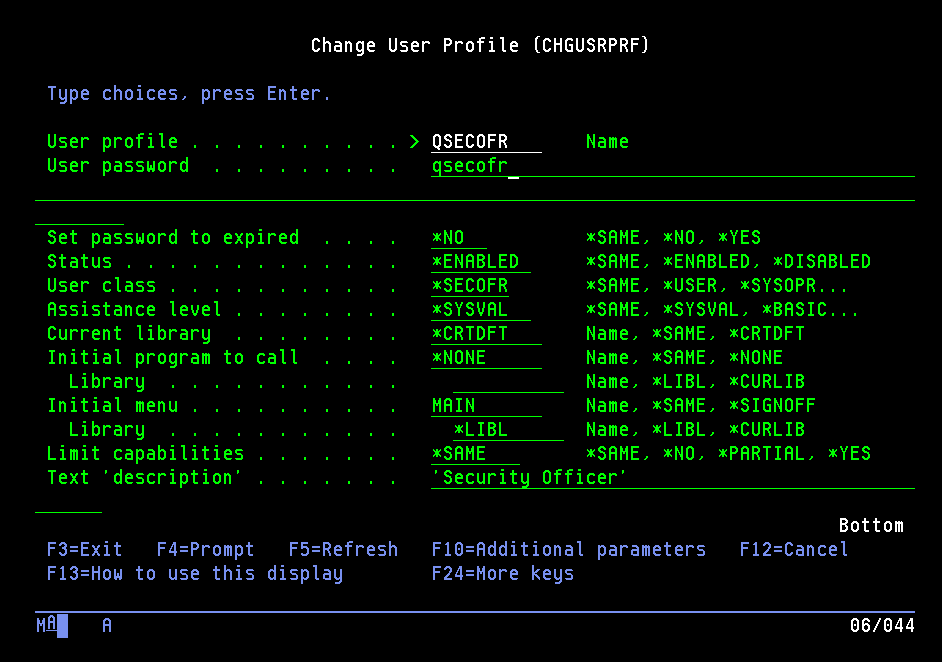
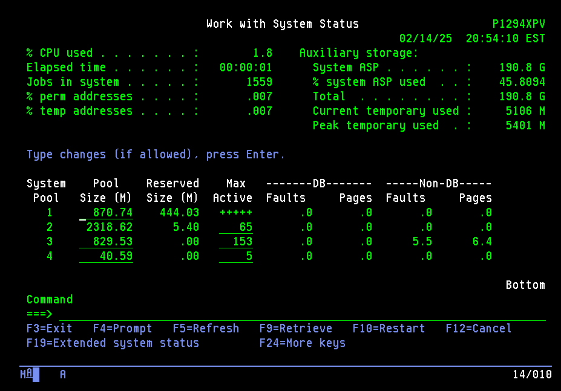
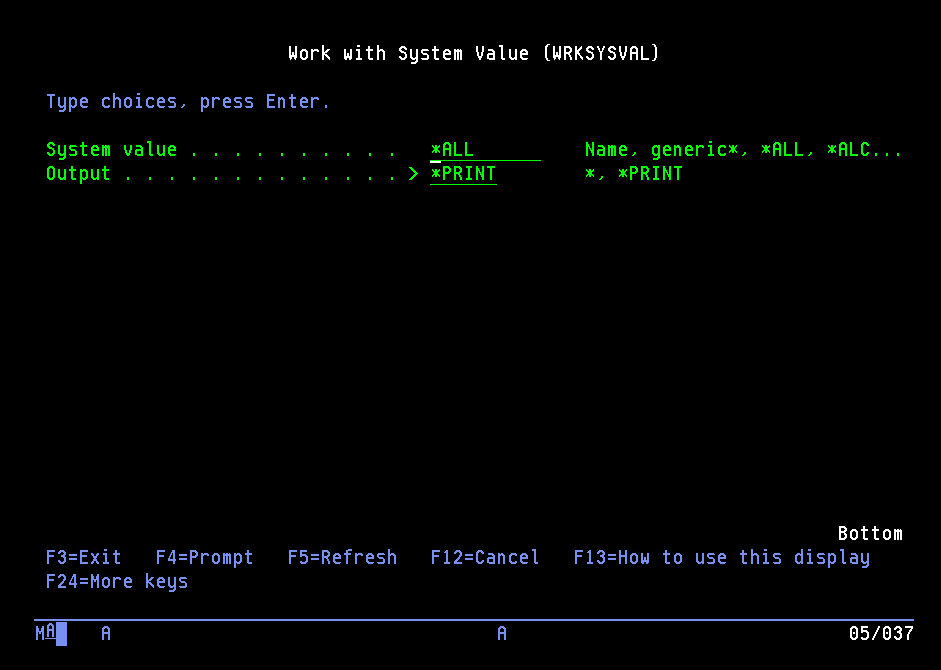
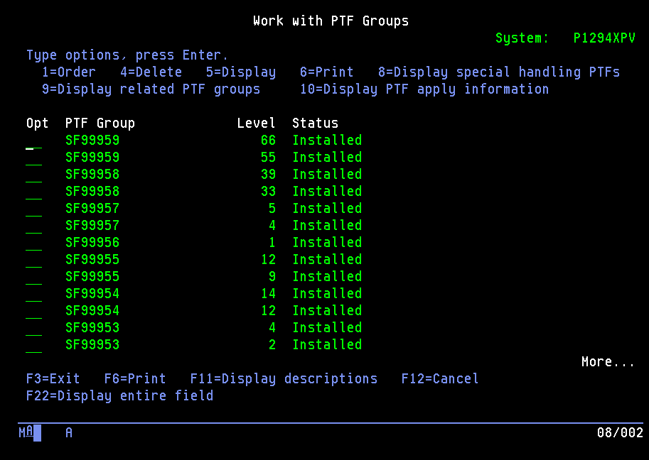
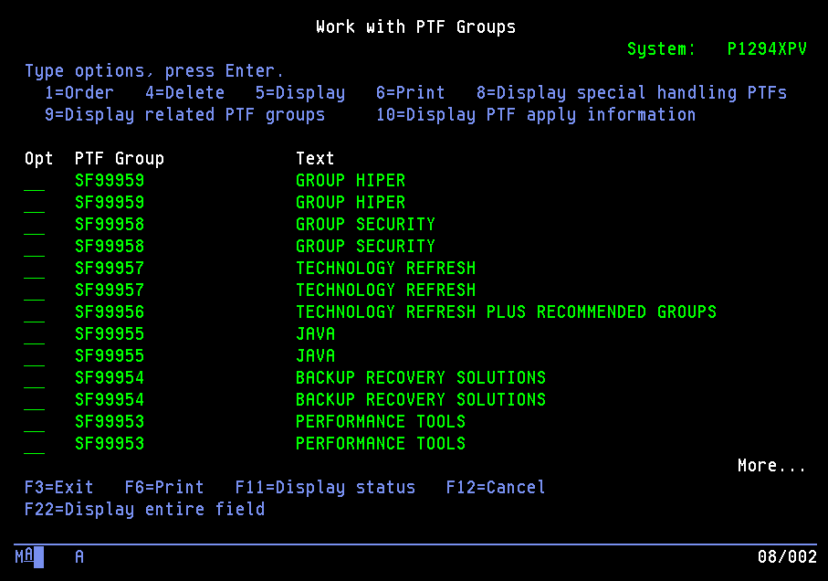
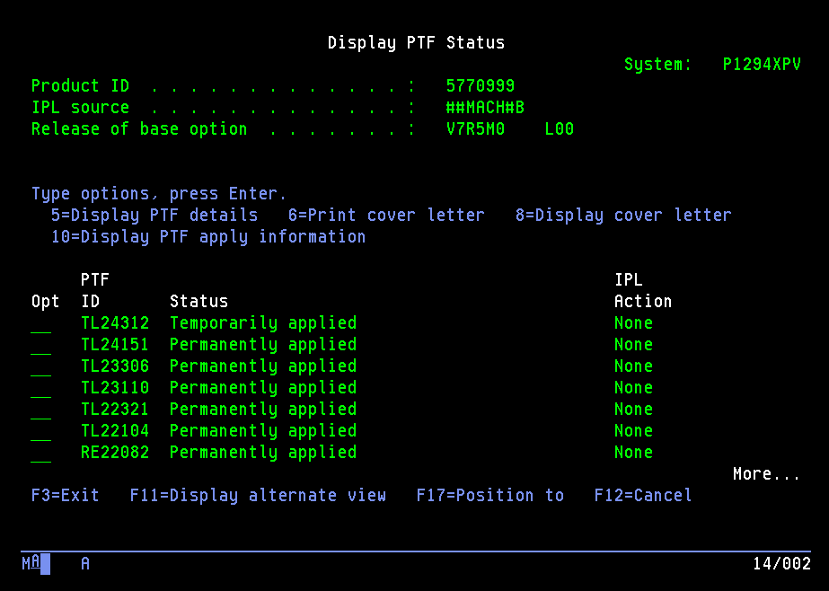

# Learning basic AS400 - project relocation danamon

Before we going to shutdown the server, we need to capture all of the existing server status and device status. Below is the simulation how to capture and make documentation before relocation.
{: .notice--warning}

## 1. AS400
### Change password AS400
Note: to show command that will be executed press `F14` or `Shift + F2`
```bash
CHGUSRPRF USRPRF(CECUSER) PASSWORD(CECUSER)
CHGUSRPRF USRPRF(QSECOFR) PASSWORD(QSECOFR)
```




### Collect System Status
```bash
WRKSYSSTS
```


### Collect System Values
```bash
WRKSYSVAL OUTPUT(*PRINT)
```


### Collect PTF & PTF Group

```bash
WRKPTFGRP > F6=Print
```


```bash
DSPPTF OUTPUT(*PRINT)
```


### Collect all Hardware resource for Storage & Communication

```bash
WRKHDWRSC *STG > F6
WRKHDWRSC *CMN > F6
WRKSYSSTS OUTPUT(*PRINT)
```
```bash
STRSST > 1 > 7 > F6
CFGTCP > 2 > F6
CFGTCP > 10 > F6
```
- Collect `sysplan` HMC
```bash
WRKSBS OUTPUT(*PRINT)
WRKDSKSTS OUTPUT(*PRINT)
```


### Command to shutdown MIMIX
1. END DATA GROUP
```bash
ENDDG DGNAME(data-group-name) OPTION(*IMMED)
ENDDG DGFN(*ALL) OPTION(*IMMED)
```
2. END MANAGER
```bash
ENDMMGR OPTION(*IMMED)
```

### Command to shutdown AS400
3. END SUBSYSTEMS
```bash
ENDSBS SBS(*ALL) OPTION(*IMMED)
WRKSBS
```

4. POWERDOWN SYSTEM
```bash
PWRDWNSYS OPTION(*CNTRLD) DELAY(1)
```

## 2. FS5000
### Shutdown FS5000
1. Check `Host` > make sure all hosts are `down/offline`
2. Go to `System-Hardware Overview` > `Power Off Systems`
3. The Web GUI will automatically logout then the IP Web GUI can't be reach 

## 3. SAN Switch Brocade
### Collect log SANSwitch
Open putty and run below commands
```bash
switchshow
zoneshow
supportshow
```
Shutdown sanswitch
```bash
switchshow # make sure all the WWPN status is down
sysshutdown
```
